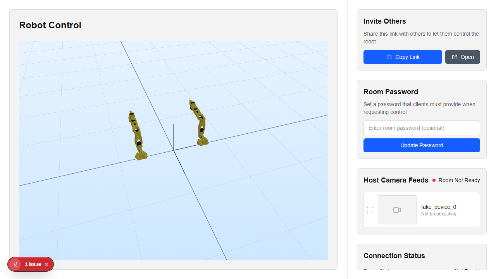
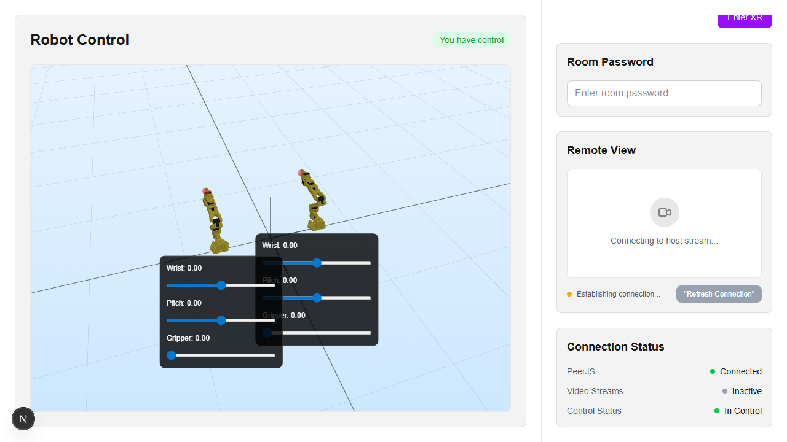
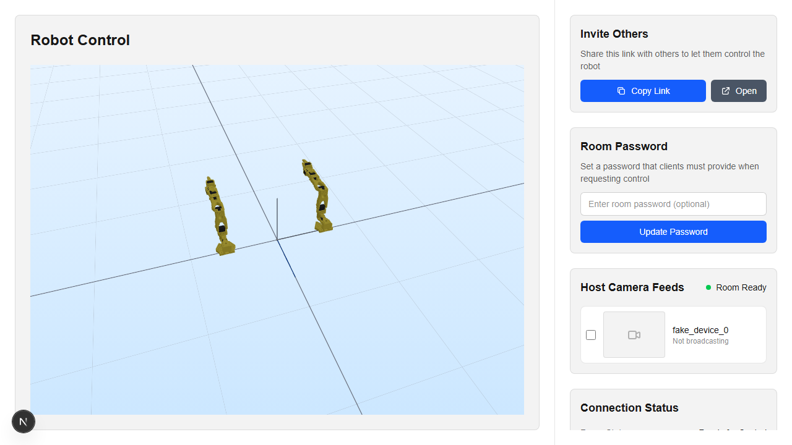
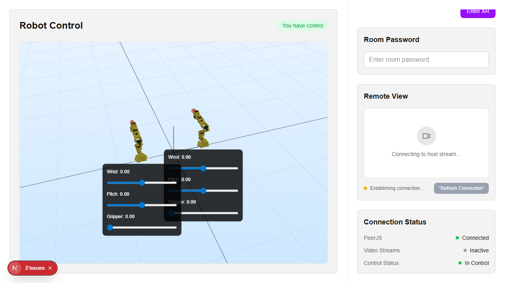

# PR: Real-time Communication & Resilience Improvements

This PR transitions Teletable to a realtime-first room sync model and significantly improves host-client connection resilience, ensuring clients automatically reconnect when the host restarts or its peer ID changes.

## Key Features

### 1. Supabase Realtime Integration
- Room metadata now subscribes to Supabase Realtime in `useBasicRoomInfo` via `useRoomRealtime`.
- Room state (host Peer ID, controlling client, requests) updates on row changes without tight polling loops.
- A lightweight fallback refresh remains as a safety net for missed/disconnected realtime events.

### 2. Reactive Connection Status
- The `usePeer` hook now internally tracks active media connections.
- The `useIsVideoCallConnected` hook is now fully reactive, removing the need for 1-second interval polling to check connection status.
- UI status indicators for PeerJS and Video Call status now update immediately upon connection state changes.

### 3. Connection Resilience & Auto-Reconnect
- Improved `useMultiVideoCallConnectionClientside` to handle host restarts.
- Clients now monitor the `hostPeerId` via Supabase Realtime. If the ID changes (indicating a host reset), the client automatically cleans up the old connection and re-initiates a handshake with the new Peer ID.
- Reconnection logic includes exponential backoff with robust cleanup guards to avoid duplicate reconnect storms.
- `useDataConnectionClientside` now also reconnects automatically on close/error with backoff.

### 4. Code Cleanup & Modernization
- Removed obsolete polling hooks: `useVideoCall`, `useConnectionRefresh`.
- Cleaned up unused imports and simplified the `ClientView` component hierarchy.
- Introduced a dedicated `useRoomRealtime` hook for clean Supabase channel management.

## Automated Testing (Playwright)

A new Playwright test suite has been added in `tests/realtime.spec.ts` to verify:
1. Initial host/client handshake.
2. Control request and approval flow.
3. Automatic client reconnection after a simulated host page refresh.

**To run the tests:**
```bash
npx playwright test tests/realtime.spec.ts
```

## Screenshots (Captured)

### Host View - Room Ready

*Host successfully initialized with Peer ID and ready for control.*

### Client View - Real-time Status

*Client connected and in control with active peer/data links.*

### Host After Restart

*Host restarted and published a new peer ID while remaining ready for control.*

### Reconnection Flow

*Client automatically re-establishing connection after a host restart.*
